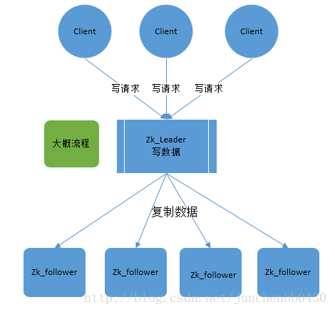
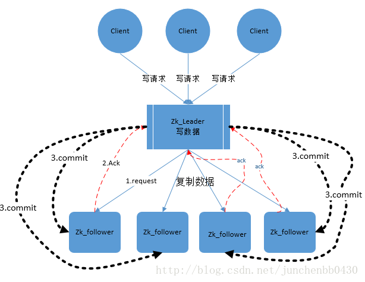

# ZAB协议

- 什么是Zab协议
- Zab 协议的作用
- Zab 协议原理
- Zab 协议核心
- Zab 协议内容
- 原子广播
- 崩溃恢复
- 如何保证数据一致性
- Zab 协议如何数据同步
- 如何处理需要丢弃的 Proposal
- Zab 协议实现原理
- 选主过程

## 什么是Zab协议
> Zookeeper原子广播  

> Zab协议是为分布式协调服务Zookeeper专门设计的一种 支持崩溃恢复 的 原子广播协议 ，是Zookeeper保证数据一致性的核心算法。Zab借鉴了Paxos算法，但又不像Paxos那样，是一种通用的分布式一致性算法。它是特别为Zookeeper设计的支持崩溃恢复的原子广播协议。

> 在Zookeeper中主要依赖Zab协议来实现数据一致性，基于该协议，zk实现了一种主备模型（即Leader和Follower模型）的系统架构来保证集群中各个副本之间数据的一致性。  
这里的主备系统架构模型，就是指只有一台客户端（Leader）负责处理外部的写事务请求，然后Leader客户端将数据同步到其他Follower节点。

> Zookeeper 客户端会随机的链接到 zookeeper 集群中的一个节点，如果是读请求，就直接从当前节点中读取数据；  
如果是写请求，那么节点就会向 Leader 提交事务，Leader 接收到事务提交，会广播该事务，只要超过半数节点写入成功，该事务就会被提交。

## Zab 协议的特性：
1）Zab 协议需要确保那些已经在 Leader 服务器上提交（Commit）的事务最终被所有的服务器提交。

2）Zab 协议需要确保丢弃那些只在 Leader 上被提出而没有被提交的事务。

## Zab 协议实现的作用

1）使用一个单一的主进程（Leader）来接收并处理客户端的事务请求（也就是写请求），并采用了Zab的原子广播协议，将服务器数据的状态变更以 事务proposal （事务提议）的形式广播到所有的副本（Follower）进程上去。

2）保证一个全局的变更序列被顺序引用。
Zookeeper是一个树形结构，很多操作都要先检查才能确定是否可以执行，比如P1的事务t1可能是创建节点"/a"，t2可能是创建节点"/a/bb"，只有先创建了父节点"/a"，才能创建子节点"/a/b"。

为了保证这一点，Zab要保证同一个Leader发起的事务要按顺序被apply，同时还要保证只有先前Leader的事务被apply之后，新选举出来的Leader才能再次发起事务。

3）当主进程出现异常的时候，整个zk集群依旧能正常工作。

## Zab协议原理
Zab协议要求每个 Leader 都要经历三个阶段：发现，同步，广播。

- 发现：要求zookeeper集群必须选举出一个 Leader 进程，同时 Leader 会维护一个 Follower 可用客户端列表。将来客户端可以和这些 Follower节点进行通信。

- 同步：Leader 要负责将本身的数据与 Follower 完成同步，做到多副本存储。这样也是提现了CAP中的高可用和分区容错。Follower将队列中未处理完的请求消费完成后，写入本地事务日志中。

- 广播：Leader 可以接受客户端新的事务Proposal请求，将新的Proposal请求广播给所有的 Follower。

## Zab协议核心
Zab协议的核心：定义了事务请求的处理方式

1）所有的事务请求必须由一个全局唯一的服务器来协调处理，这样的服务器被叫做 Leader服务器。其他剩余的服务器则是 Follower服务器。

2）Leader服务器 负责将一个客户端事务请求，转换成一个 事务Proposal，并将该 Proposal 分发给集群中所有的 Follower 服务器，也就是向所有 Follower 节点发送数据广播请求（或数据复制）

3）分发之后Leader服务器需要等待所有Follower服务器的反馈（Ack请求），在Zab协议中，只要超过半数的Follower服务器进行了正确的反馈后（也就是收到半数以上的Follower的Ack请求），那么 Leader 就会再次向所有的 Follower服务器发送 Commit 消息，要求其将上一个 事务proposal 进行提交。

